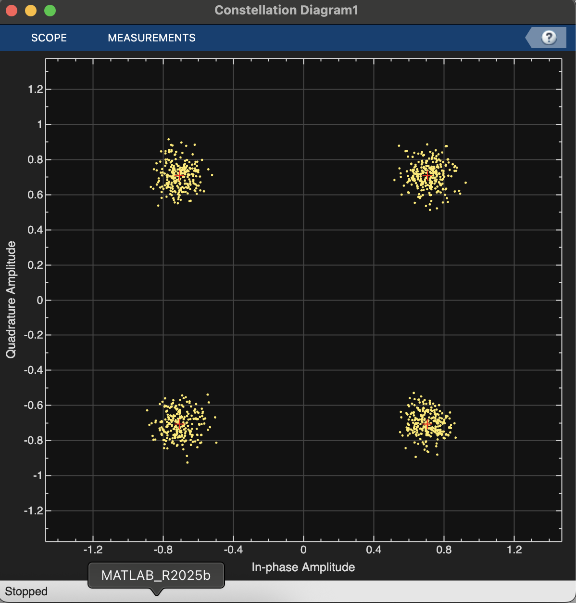

#  QPSK Transceiver Simulation & BER Analysis 

This repository contains a MATLAB/Simulink simulation of a Quadrature Phase Shift Keying (QPSK) communication system. The model demonstrates the complete digital communication chain, including modulation, transmission over a noisy channel, demodulation, and performance analysis via Bit Error Rate (BER) curves.

##  📂 Project Structure

* **`qpsk.slx`**: The main Simulink model file containing the QPSK system design.
* **`constellation_diagram.png`**: Visualization of the signal constellation (Tx and Rx) captured from the simulation scopes.
* **`BER_figure.jpg`**: Plot comparing the simulated Bit Error Rate (BER) against the theoretical exact curve.
* **`simulation.ber`**: Saved BER session data generated from the simulation.

##  🚀 System Overview

The simulation models a baseband QPSK transmission system using the following components:

1.  **Random Integer Generator**: Generates a stream of random quaternary (4-ary) symbols.
2.  **QPSK Modulator Baseband**: Maps the integer symbols to complex QPSK constellation points with a phase offset of $\pi/4$ and Gray encoding.
3.  **AWGN Channel**: Adds Additive White Gaussian Noise to the signal to simulate channel impairments based on a specified Eb/No (Energy per bit to Noise power spectral density ratio).
4.  **QPSK Demodulator Baseband**: Demodulates the noisy signal using hard decision decoding.
5.  **Error Rate Calculation**: Compares the transmitted and received bits to calculate the Bit Error Rate (BER) in real-time.

## 📊 Results

### Constellation Diagram
The system visualizes the signal quality using constellation diagrams. The image below shows the transmitted symbols (clean) versus the received symbols (noisy clouds) after passing through the AWGN channel.

### Bit Error Rate (BER) Performance
The project includes a BER analysis to evaluate system performance. The graph below illustrates the "waterfall curve," showing how the error rate decreases as the Signal-to-Noise Ratio (Eb/No) increases.

## 🛠️ Prerequisites

To run this simulation, you need:
* **MATLAB** (Tested on R2025a/R2025b based on file versions).
* **Simulink**.
* **Communications Toolbox** (Required for QPSK Modulator/Demodulator and AWGN blocks).

## 💻 How to Run

1.  Clone this repository or download the files.
2.  Open **MATLAB**.
3.  Navigate to the folder containing the files.
4.  Double-click `qpsk.slx` to open the model.
5.  Click the **Run** button in Simulink.
6.  The constellation diagrams will appear automatically.
7.  The BER data is exported to the workspace (variable `ber`) for further plotting/analysis.
